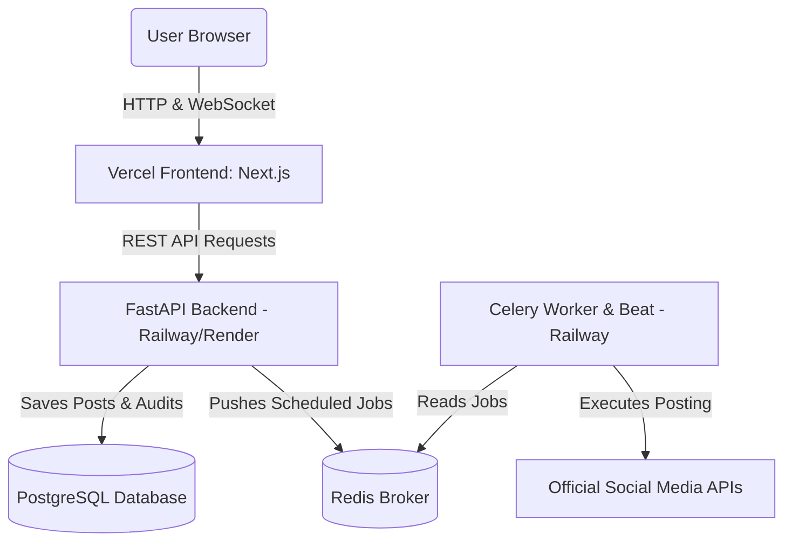

# SocialHub Enterprise: Social Media API Connection & Deployment Guide

SocialHub Enterprise uses a hybrid adapter design. If a platform's Client ID/Secret variables are missing from the environment (default state), the adapter switches to mock simulations for safe testing. When you populate these variables inside `backend/.env`, the system automatically routes authentication and publications through the official platform APIs.

---

## 1. OAuth Redirect Callback URLs

When registering your applications in the respective developer portals, configure the following callback endpoint:

*   **Callback URL**: `http://localhost:3000/social-callback`

*Note: Replace `http://localhost:3000` with your production frontend domain (e.g. `https://socialhub.vercel.app`) when deploying.*

---

## 2. Platform Portal Guides & Configurations

### A. LinkedIn
1. Go to the [LinkedIn Developer Portal](https://developer.linkedin.com/).
2. Click **Create App**, fill in details, and associate it with a LinkedIn Page.
3. Go to the **Products** tab and request access to:
   - **Share on LinkedIn** (for personal profile posts).
   - **Community Management API** (required if posting to Company Pages).
4. Go to the **Auth** tab, configure the redirect URI, and copy Client ID & Client Secret.
5. Scopes: `w_member_social`, `w_organization_social`, `r_liteprofile`.

```ini
# Add to backend/.env
LINKEDIN_CLIENT_ID=your_linkedin_client_id
LINKEDIN_CLIENT_SECRET=your_linkedin_client_secret
```

---

### B. Instagram (Meta Graph API)
1. Go to the [Meta Developer Portal](https://developers.facebook.com/).
2. Click **Create App** and choose **Other** -> **Business** (this allows access to Pages and Instagram Graph APIs).
3. Add the **Facebook Login for Business** product to your app.
4. Configure the OAuth redirect URI under settings.
5. Add permissions: `pages_manage_posts`, `pages_read_engagement`, `instagram_basic`, `instagram_content_publish`.
6. Copy the App ID and App Secret.

```ini
# Add to backend/.env
META_CLIENT_ID=your_facebook_app_id
META_CLIENT_SECRET=your_facebook_app_secret
```

---

### C. X (Twitter)
1. Go to the [X Developer Portal](https://developer.twitter.com/).
2. Sign up for developer access (Basic/Pro tier required to post content via v2).
3. Create a project and add a new App.
4. Enable **OAuth 2.0** under **User authentication settings**.
5. Select **Web App, Automated App or Bot** as the App Type.
6. Set **App Permissions** to **Read and Write**.
7. Configure redirect URI.
8. Save the generated Client ID and Client Secret.

```ini
# Add to backend/.env
X_CLIENT_ID=your_x_oauth_client_id
X_CLIENT_SECRET=your_x_oauth_client_secret
```

---

### D. Naukri
1. Go to the **Naukri Developer/Recruiter Integration Portal**.
2. Create a new Client App credentials record.
3. Configure the redirect URI to point to `/social-callback` on your frontend domain.
4. Select/request scopes: `manage_jobs`, `view_analytics`, `organization_profile`.
5. Save the generated Client ID and Client Secret.

```ini
# Add to backend/.env
NAUKRI_CLIENT_ID=your_naukri_client_id
NAUKRI_CLIENT_SECRET=your_naukri_client_secret
```

---

## 3. Production Hosting & Deployment Strategy

### Q: Can I host the entire application only using Vercel?
**No.** Vercel is designed for serverless, frontend-first applications. While you can host the Next.js frontend on Vercel, the backend cannot be hosted *only* on Vercel because of two major architectural requirements:
1. **Celery Worker & Beat**: The app relies on a persistent background queue worker and a beat scheduler (`publish_scheduled_posts`) to publish scheduled posts at precise times. Vercel's serverless functions terminate after a brief timeout (typically 10-60s) and cannot run background loops or listeners.
2. **Redis & DB**: Celery requires a message broker (Redis) and a database (PostgreSQL/SQLite) that must be running persistently.

---

### Recommended Production Deployment Setup (Hybrid Architecture)



#### Step 1: Deploy Next.js Frontend on Vercel
1. Connect your repository to your Vercel account.
2. Choose **Vercel Next.js Preset**.
3. Add the following environment variable to Vercel settings:
   - `NEXT_PUBLIC_API_URL`: The URL of your hosted backend (e.g. `https://api.socialhub.corp`).
4. Trigger the deployment.

#### Step 2: Deploy Backend & Services on Railway / Render (Recommended)
Platforms like **Railway** or **Render** allow you to deploy the backend services using Docker Compose directly from your GitHub repository, running the complete multi-container stack:
1. Deploy a **PostgreSQL** service and a **Redis** service (Railway provides single-click templates for both).
2. Deploy the **FastAPI Web Service** container (executing `uvicorn app.main:app`).
3. Deploy the **Celery Background Worker** container (executing `celery -A app.core.celery_app.celery_app worker --loglevel=info`).
4. Deploy the **Celery Beat Scheduler** container (executing `celery -A app.core.celery_app.celery_app beat --loglevel=info`).
5. Map the environment variables (`DATABASE_URL`, `REDIS_URL`, encryption keys, and official social API keys) to the backend containers.
